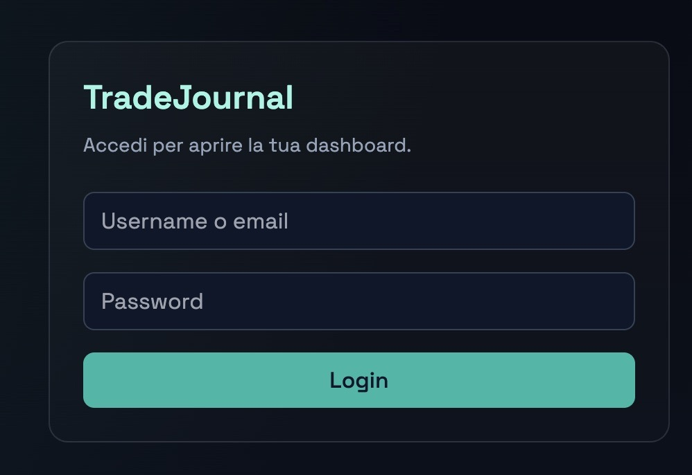
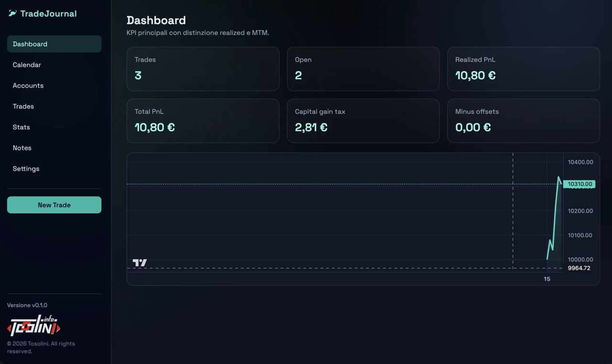
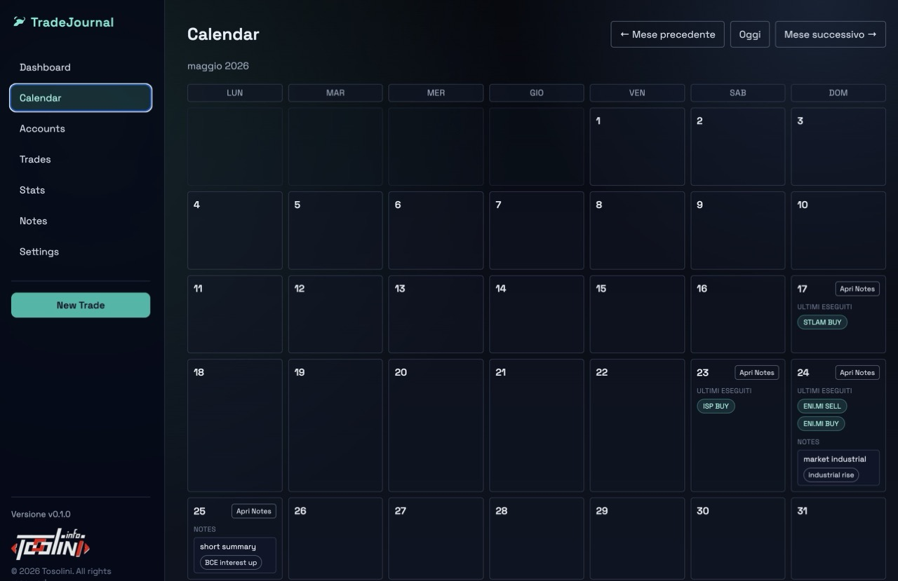
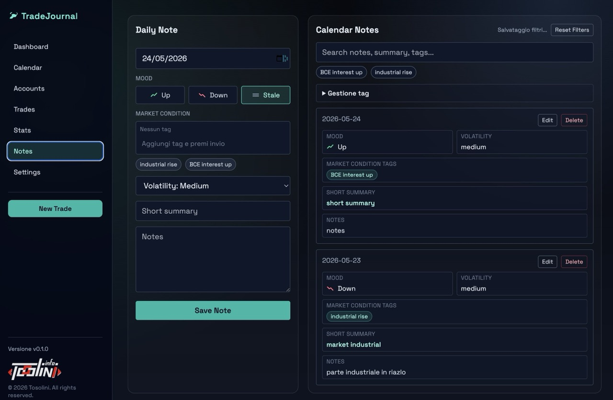
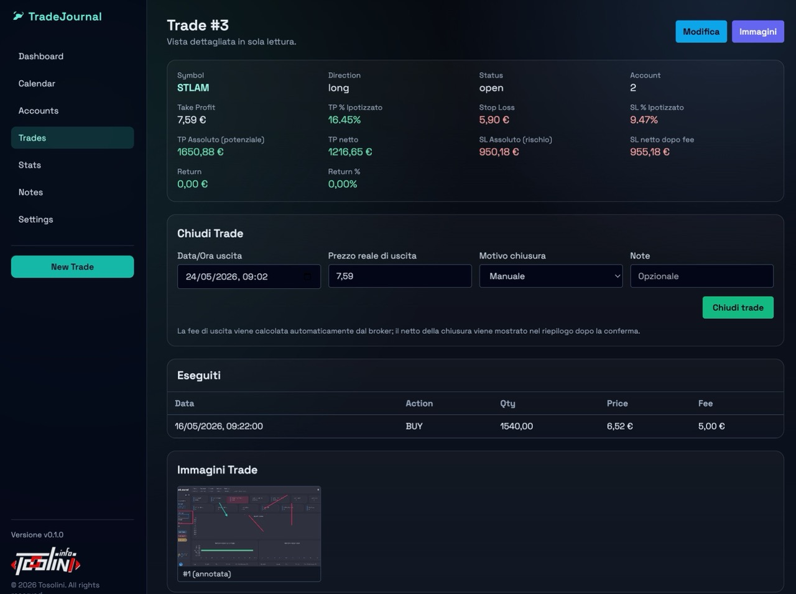
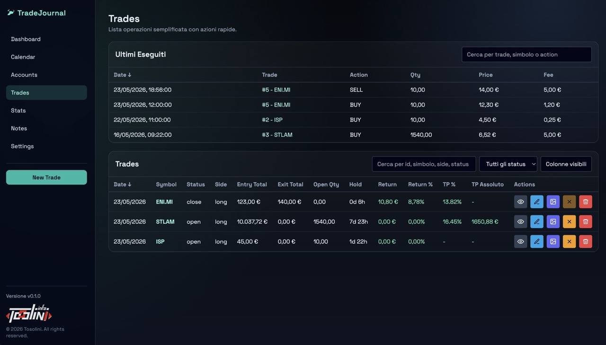

#

Self-hosted trading journal MVP (FastAPI + React + PostgreSQL) with weighted-average PnL, daily notes, image support, monthly journal calendar, mark-to-market snapshots, user management, light/dark theme support, and portfolio tracking for ETFs and bonds.

This project is a personal trading journal application designed to help traders track their performance, analyze their trades, manage users and permissions, and maintain a daily trading log. It includes features such as weighted-average PnL calculations, daily notes with mood presets and market condition tags, image uploads for trade annotations, a monthly journal calendar for easy navigation, portfolio snapshots, and asset registries for instruments such as ETFs and bonds.

On broker you can set fee-aware net values, which are used in the trade detail page and portfolio calculations to provide more accurate profit/loss projections and summaries.

Trade page can also show net value after each execution, with fee and tax-aware calculations, which can be useful for intraday trade management and quick close decisions.

The frontend also supports persistent light/dark theme switching, while the settings area includes profile management and admin-only user management flows.

You can also upload images related to trades, such as annotated charts or screenshots, and view them in the trade detail page. There is a dedicated endpoint to serve annotated images, which can be used for quick reference without needing to download the original image.

**This is not a final deployable product**, but more features are coming in the next deployment stages. The main goal is to have a working MVP to iterate on and gather feedback, while keeping the scope manageable and focused on core functionalities.

## Attention, read before using

This is still an MVP with known limitations and trade-offs. It is intended for local/private usage, demos, and iterative development.

Do not use this code as-is in production without hardening, security review, and broader test coverage.

The entire project is meant to be used on localhost or private networks. **Do not expose microservices on internet.**

## Current version

- Backend: `0.1.5` (`backend/pyproject.toml`)
- Frontend: `0.1.5` (`frontend/package.json`)

more details on change log and versioning strategy in the [CHANGELOG.md](CHANGELOG.md) file.

## Quick start

1. Copy the env file.
2. Start the stack with Docker Compose.
3. Open frontend and API docs.

```bash
cp .env.example .env
docker compose up --build
```

- Frontend: http://localhost:15173
- API docs: http://localhost:18000/docs

## Default admin user (auto-seeded)

At backend startup, an admin user is automatically created if missing.

- email: `admin@example.com`
- username: `admin`
- password: `password123`

Override via env variables:

- `SEED_ADMIN_ENABLED`
- `SEED_ADMIN_EMAIL`
- `SEED_ADMIN_USERNAME`
- `SEED_ADMIN_PASSWORD`

Always change these values outside local development.

## Implemented features

- JWT auth (register/login/me)
- User profile preferences persisted in DB (`users.preferences` JSONB)
- User account settings (email, username, password change)
- Admin user management (list/create/update/delete users)
- Persistent light/dark theme preference in frontend
- Accounts CRUD
- Broker CRUD + assignment to accounts
- Trades CRUD with weighted-average metrics
- Executions management + quick close flow
- Trade detail page with TP/SL projections and net calculations
- Trade image upload + annotated image endpoint
- Dashboard KPIs
- Assets registry CRUD with instrument types including ETF, stock, bond, and fund
- Portfolio summary, holdings detail, and history endpoints
- Daily notes with:
	- mood presets (`up`, `down`, `stale`)
	- market condition tags with suggestions
	- edit/delete support
	- global tag rename/delete utilities
	- persisted notes filters (search/tags) in user DB preferences
- Calendar section:
	- monthly view
	- per-day latest executions (chip style)
	- per-day notes preview
	- links to trade details and day-filtered notes
- Market calendar endpoints (today + monthly journal aggregation)
- Daily snapshots and manual recompute endpoint
- Runtime schema compatibility checks for legacy DBs

## UI walkthrough

### 1. Login

Authentication entry point for local users.



### 2. Dashboard (alpha version)

Overview of KPIs and the main operational summary.



### 3. Calendar

Monthly journal calendar with daily notes previews and latest executions per day.



### 4. Notes (not final version)

Daily notes workspace with mood presets, market condition tags, filters, and note management.



### 5. Trade detail

Detailed trade view with TP/SL projections, fee-aware net values, executions, and images.



### 6. Trades list

Trade list with sorting, quick actions, and customizable visible columns.



## Architecture

- Backend: FastAPI + SQLAlchemy + Alembic + APScheduler
- Frontend: React + TypeScript + Vite + Tailwind + TanStack Query
- Database: PostgreSQL 16
- Storage: Docker volumes for DB and uploaded media

## API overview

- Auth
	- `POST /api/auth/register`
	- `POST /api/auth/login`
	- `GET /api/auth/me`
	- `PATCH /api/auth/me`
	- `GET /api/auth/preferences`
	- `PATCH /api/auth/preferences`

- Admin user management
	- `GET /api/admin/users`
	- `POST /api/admin/users`
	- `PATCH /api/admin/users/{user_id}`
	- `DELETE /api/admin/users/{user_id}`

- Accounts
	- `POST /api/accounts`
	- `GET /api/accounts`
	- `PATCH /api/accounts/{account_id}`
	- `DELETE /api/accounts/{account_id}`

- Assets
	- `POST /api/assets/`
	- `GET /api/assets/`
	- `PATCH /api/assets/{asset_id}`
	- `DELETE /api/assets/{asset_id}`

- Brokers
	- `POST /api/brokers`
	- `GET /api/brokers`
	- `PATCH /api/brokers/{broker_id}`
	- `DELETE /api/brokers/{broker_id}`

- Trades and executions
	- `POST /api/trades`
	- `GET /api/trades`
	- `GET /api/trades/{trade_id}`
	- `PATCH /api/trades/{trade_id}`
	- `DELETE /api/trades/{trade_id}`
	- `POST /api/trades/{trade_id}/executions`
	- `PATCH /api/trades/{trade_id}/executions/{execution_id}`
	- `POST /api/trades/{trade_id}/close`
	- `GET /api/trades/executions/recent`

- Notes
	- `POST /api/notes`
	- `GET /api/notes`
	- `PUT /api/notes/{note_id}`
	- `DELETE /api/notes/{note_id}`
	- `GET /api/notes/suggestions/market-condition`
	- `POST /api/notes/tags/rename`
	- `POST /api/notes/tags/delete`

- Uploads
	- `POST /api/uploads/trade/{trade_id}`
	- `POST /api/uploads/trade-images/{image_id}/annotated`
	- `GET /api/uploads/trade-images/{image_id}/content`

- Dashboard
	- `GET /api/dashboard/kpis`

- Market calendar
	- `GET /api/market-calendar/today`
	- `GET /api/market-calendar/journal-month`

- Portfolio
	- `GET /api/portfolio/details`
	- `GET /api/portfolio/summary`
	- `GET /api/portfolio/history`

- Snapshots
	- `GET /api/snapshots`
	- `POST /api/snapshots/recompute`

## Backend commands (inside backend container)

```bash
alembic upgrade head
pytest -q
```

## Notes for existing databases

Startup includes compatibility checks for legacy schemas (for example, missing `users.preferences` and earlier incremental columns).

On fresh environments, run Alembic migrations normally.

## Known MVP compromises

- Calendar UI intentionally keeps compact day cards (partial day content preview)
- Chunk size warnings are expected in frontend production build
- Euronext holiday/cutoff abstraction is simplified and code-configured

## Author
- Walter Tosolini
- website: https://www.tosolini.info
- linkedin: https://www.linkedin.com/in/waltertosolini/

## License
MIT License