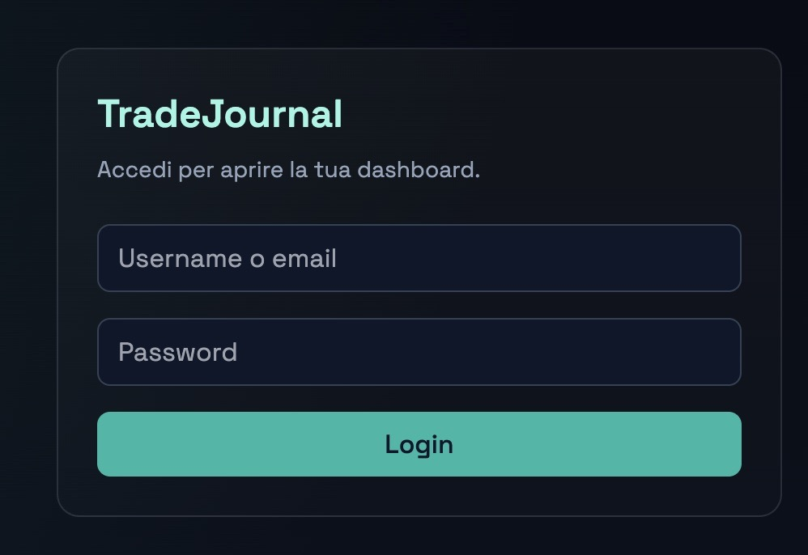
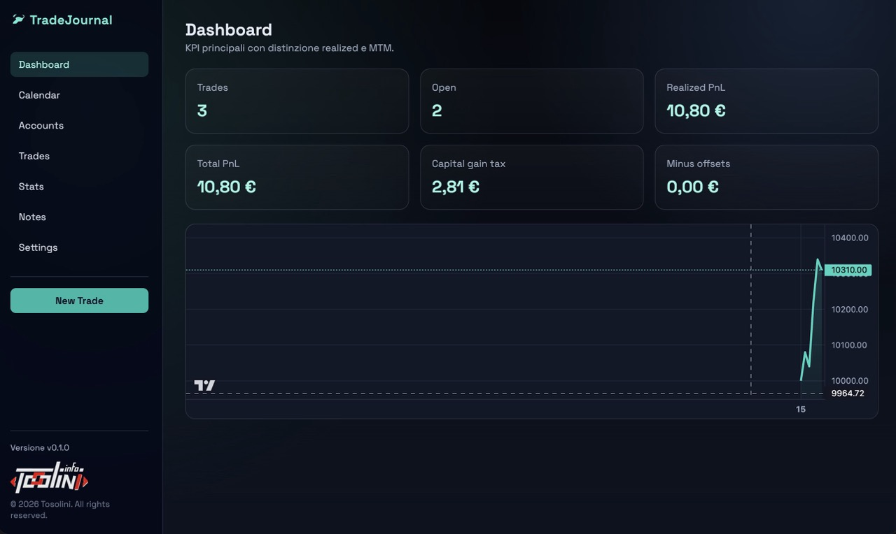
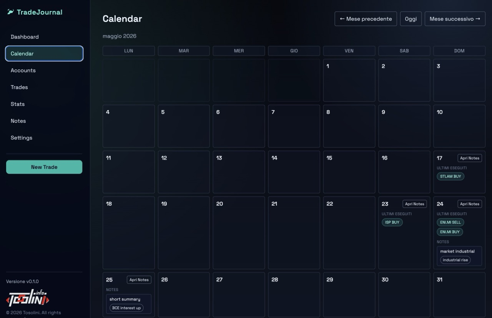
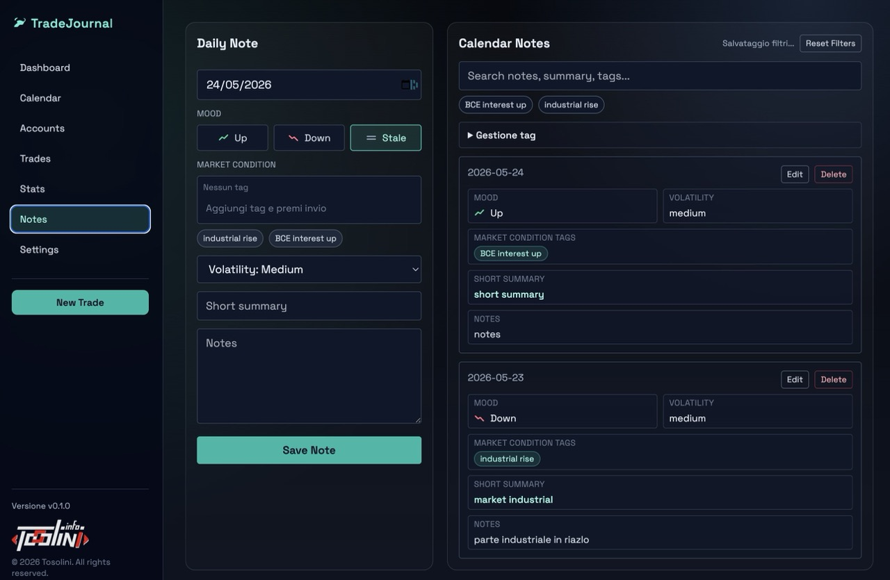
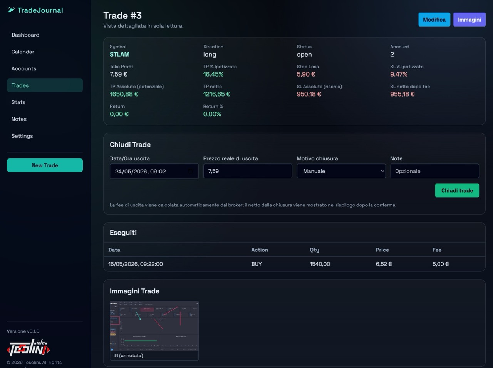
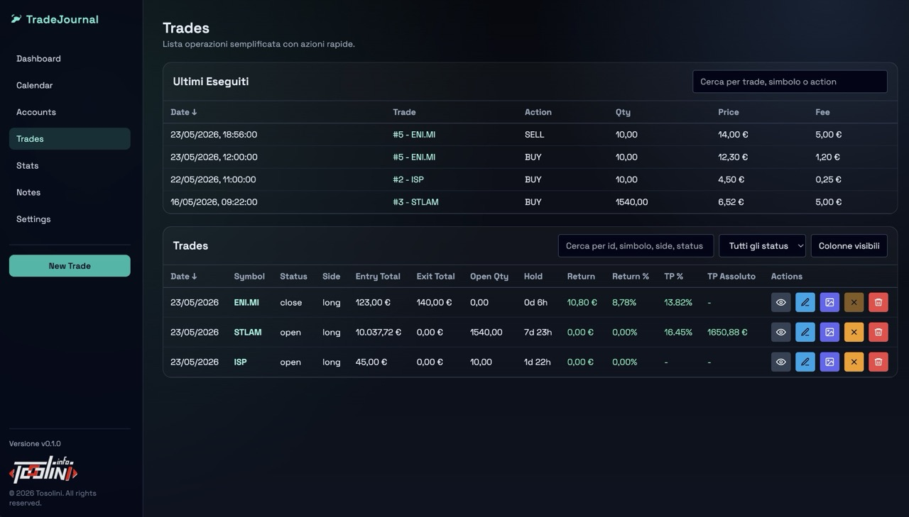

#

Self-hosted trading journal (FastAPI + React + PostgreSQL) with weighted-average PnL, a guided trade wizard, real-time dashboards, daily notes, image support, a monthly journal calendar, mark-to-market snapshots, portfolio tracking for ETFs and bonds, a cash ledger, full data export/import, user management, and light/dark themes.

This project is a personal trading journal application designed to help traders track their performance, analyze their trades, manage users and permissions, and maintain a daily trading log. It includes features such as:

- **Trade entry wizard** (6 steps) or a compact quick-trade form
- Weighted-average PnL calculations with fee- and tax-aware net values
- **Dashboard** with KPIs, equity curve, monthly/daily PnL, asset allocation and top trades
- **Performance** page with portfolio value evolution, daily PnL and a color-coded monthly calendar
- **Portfolio** tracking for ETFs and bonds (holdings, mark-to-market via Yahoo Finance)
- Daily notes with a rich-text editor, mood presets and market condition tags
- Image uploads for trade annotations (PNG/JPEG/GIF/WebP) with a dedicated serving endpoint
- Monthly journal calendar with per-day execution chips and note previews
- Broker-level commission and capital-gain tax configuration
- Cash ledger (deposits/withdrawals) per account
- Daily snapshots (positions + portfolio) computed automatically at a configurable time
- Full JSON export/import of all user data
- Persistent light/dark theme switching, profile management and admin-only user management

**This is not a final deployable product**, but more features are coming in the next deployment stages. The main goal is to have a working MVP to iterate on and gather feedback, while keeping the scope manageable and focused on core functionalities.

## Attention, read before using

This is still an MVP with known limitations and trade-offs. It is intended for local/private usage, demos, and iterative development.

Do not use this code as-is in production without hardening, security review, and broader test coverage.

The entire project is meant to be used on localhost or private networks. **Do not expose microservices on internet.**

## Current version

- Backend: `0.1.5` (`backend/pyproject.toml`)
- Frontend: `0.1.7` (`frontend/package.json`)

More details on change log and versioning strategy in the [changelog.md](changelog.md) file.

## Quick start — published images (recommended)

Pre-built images are published to GitHub Container Registry for `linux/amd64` and `linux/arm64`:

- `ghcr.io/tosolini/tradejournal/backend`
- `ghcr.io/tosolini/tradejournal/frontend`

Tags: `main` (latest build of the `main` branch), a short commit SHA, and semver tags like `0.1.7` / `0.1` once a release is tagged. Pin to a specific tag instead of `main` for reproducible deployments.

1. Copy the env file and adjust secrets (`JWT_SECRET_KEY`, `POSTGRES_PASSWORD`, admin credentials).
2. Save the compose file below as `docker-compose.prod.yml`.
3. Start the stack (this pulls the images, starts PostgreSQL, runs migrations, then starts the apps).

```bash
cp .env.example .env
docker compose -f docker-compose.prod.yml up -d
```

> ⚠️ The backend **refuses to start** when `ENVIRONMENT=production` with a weak/default `JWT_SECRET_KEY` (must be ≥ 32 random chars) or a weak `SEED_ADMIN_PASSWORD` (must be ≥ 12 chars, not a known default). Generate a secret with `openssl rand -hex 32`.

```yaml
services:
  db:
    image: postgres:16-alpine
    environment:
      POSTGRES_DB: ${POSTGRES_DB}
      POSTGRES_USER: ${POSTGRES_USER}
      POSTGRES_PASSWORD: ${POSTGRES_PASSWORD}
    volumes:
      - db_data:/var/lib/postgresql/data

  backend:
    image: ghcr.io/tosolini/tradejournal/backend:main
    environment:
      ENVIRONMENT: ${ENVIRONMENT:-production}
      DATABASE_URL: ${DATABASE_URL}
      JWT_SECRET_KEY: ${JWT_SECRET_KEY}
      JWT_ACCESS_TOKEN_EXPIRE_MINUTES: ${JWT_ACCESS_TOKEN_EXPIRE_MINUTES}
      APP_TIMEZONE: ${APP_TIMEZONE}
      MARKET_CLOSE_CUTOFF: ${MARKET_CLOSE_CUTOFF}
      SNAPSHOT_TIME: ${SNAPSHOT_TIME}
      MEDIA_ROOT: ${MEDIA_ROOT}
      CORS_ORIGINS: ${CORS_ORIGINS}
      SEED_ADMIN_ENABLED: ${SEED_ADMIN_ENABLED}
      SEED_ADMIN_EMAIL: ${SEED_ADMIN_EMAIL}
      SEED_ADMIN_USERNAME: ${SEED_ADMIN_USERNAME}
      SEED_ADMIN_PASSWORD: ${SEED_ADMIN_PASSWORD}
    depends_on:
      - db
    ports:
      - "127.0.0.1:18000:8000"
    volumes:
      - media_data:/app/media

  frontend:
    image: ghcr.io/tosolini/tradejournal/frontend:main
    depends_on:
      - backend
    ports:
      - "127.0.0.1:15173:80"

volumes:
  db_data:
  media_data:
```

- Frontend: http://localhost:15173
- API docs: http://localhost:18000/docs
- Backend health: http://localhost:18000/health

How it works:

- The backend image runs `alembic upgrade head` at startup (retrying until PostgreSQL accepts connections), then starts uvicorn.
- The frontend image serves the SPA through nginx and proxies `/api/` and `/health` to the backend service (default `http://backend:8000`, using Docker DNS — the service name `backend` above matches this default).
- The browser only ever talks to the frontend origin (same-origin proxy), so CORS is never triggered on this path. If you call the backend directly instead, set `CORS_ORIGINS` to your frontend origin, or `*` (wildcard disables credentialed CORS; auth is Bearer-header only).
- Media uploads are stored under `MEDIA_ROOT` (default `/app/media`), mounted as the `media_data` volume. Only PNG/JPEG/GIF/WebP files are accepted; responses enforce `nosniff` and serve unknown types as downloads.
- The sample binds both services to `127.0.0.1`. To expose on a private LAN, change the bindings to `0.0.0.0` (or the host IP) and set `CORS_ORIGINS` accordingly.

### Cross-host deployment (frontend and backend on different machines)

Run the frontend with `BACKEND_URL` pointing at the reachable backend (the proxy stays same-origin for the browser, so CORS is not involved):

```yaml
  frontend:
    image: ghcr.io/tosolini/tradejournal/frontend:main
    environment:
      BACKEND_URL: http://192.168.1.20:18000
    ports:
      - "127.0.0.1:15173:80"
```

## Optional: build from source

### Production images

Build the same images locally instead of pulling them:

```bash
docker build -f docker/backend.Dockerfile -t ghcr.io/tosolini/tradejournal/backend:main ./backend
docker build -f docker/frontend.Dockerfile -t ghcr.io/tosolini/tradejournal/frontend:main ./frontend
```

The production Dockerfiles live in `docker/` (the `backend/Dockerfile` and `frontend/Dockerfile` are dev-only and used by the dev compose stack).

### Development stack (hot reload)

```bash
cp .env.example .env
docker compose up --build
```

- Frontend: http://localhost:15173
- API docs: http://localhost:18000/docs

Both services are bound to `127.0.0.1` only. A devcontainer (`devcontainer`) is also available for a full IDE-backed testing environment (backend, frontend and PostgreSQL inside Visual Studio Code).

## Default admin user (auto-seeded)

At backend startup, an admin user is automatically created if missing.

- email: `admin@example.com`
- username: `admin`
- password: `password123`

Override via env variables:

- `SEED_ADMIN_ENABLED`
- `SEED_ADMIN_EMAIL`
- `SEED_ADMIN_USERNAME`
- `SEED_ADMIN_PASSWORD`

Always change these values outside local development. In `production` mode the backend refuses to start with the default password (≥ 12 chars required). Regular users can only be created with the `user` role via self-registration; the `admin` role is granted exclusively by an administrator.

## Implemented features

- JWT auth (register/login/me); registration always yields the `user` role
- User profile preferences persisted in DB (`users.preferences` JSONB)
- User account settings (email, username, password change)
- Admin user management (list/create/update/delete users)
- Persistent light/dark theme preference in frontend
- Accounts CRUD + cash ledger (deposits/withdrawals, in/out/net totals)
- Broker CRUD with commission (fixed/percent) and capital-gain tax (immediate/year-end) configuration
- Exchanges CRUD + broker↔exchange linking + Directa seed
- Trades CRUD with weighted-average metrics
- **New Trade wizard** (6 steps) and quick-trade form, with symbol autocomplete
- Executions management, auto-computed broker fees, quick close flow
- Trade detail with TP/SL projections (price/%, absolute and net), current market data (Yahoo Finance) and close summary with tax estimate
- Trade image upload (PNG/JPEG/GIF/WebP) + annotated image endpoint with `nosniff` serving
- Dashboard: KPI cards, equity curve (1M/3M/6M/1Y/ALL), outcome donut, monthly and all-assets daily PnL, asset allocation, top trades
- Performance page: portfolio value, equity curve, daily PnL bars, color-coded monthly calendar with day detail
- Assets registry CRUD with instrument types including ETF, stock, bond, and fund
- Portfolio: holdings CRUD, summary, details (current price via Yahoo Finance) and history endpoints
- Daily notes with:
  - rich-text editor (sanitized on render)
  - mood presets (`up`, `down`, `stale`)
  - market condition tags with suggestions, rename/delete utilities
  - persisted notes filters (search/tags) in user DB preferences
- Calendar section:
  - monthly view with per-day execution chips and note previews, deep links to trades and notes
  - markets Gantt chart of exchange opening hours
- Market calendar endpoints (today + monthly journal aggregation)
- Daily snapshots (positions + portfolio) via scheduled job (APScheduler) at a configurable time, plus manual recompute endpoints
- Full JSON data export/import (`/api/data/export`, `/api/data/import`)
- Runtime schema compatibility checks for legacy DBs

## UI walkthrough

### 1. Login

Authentication entry point for local users.



### 2. Dashboard

KPI cards, equity curve, monthly/daily PnL, asset allocation and top trades — the complete operational summary.



### 3. Calendar

Monthly journal calendar with daily notes previews, latest executions per day, and the markets Gantt tab.



### 4. Notes

Daily notes workspace with rich-text editor, mood presets, market condition tags, filters, and note management.



### 5. Trade detail

Detailed trade view with TP/SL projections, fee-aware net values, current market data, executions, close form, chart/technical tabs and images.



### 6. Trades list

Trade list with sorting, status filter, toggleable columns, quick actions (view, edit, images, quick close, delete) and recent executions.



> Portfolio, Performance, Accounts (with cash ledger) and the data export/import live under their sidebar sections — see the in-app **Help** manual for the full guide.

## Architecture

- Backend: FastAPI + SQLAlchemy + Alembic + APScheduler + yfinance (market data)
- Frontend: React + TypeScript + Vite + Tailwind + TanStack Query
- Database: PostgreSQL 16
- Storage: Docker volumes for DB and uploaded media

## API overview

All endpoints require a Bearer JWT (`POST /api/auth/login`) except `/health`, `/api/auth/register`, `/api/auth/login` and `/api/market-calendar/today`. Admin routers additionally enforce the `admin` role.

- Auth
  - `POST /api/auth/register`
  - `POST /api/auth/login`
  - `GET /api/auth/me`
  - `PATCH /api/auth/me`
  - `GET /api/auth/preferences`
  - `PATCH /api/auth/preferences`

- Admin user management
  - `GET /api/admin/users`
  - `POST /api/admin/users`
  - `PATCH /api/admin/users/{user_id}`
  - `DELETE /api/admin/users/{user_id}`

- Accounts
  - `POST /api/accounts`
  - `GET /api/accounts`
  - `PATCH /api/accounts/{account_id}`
  - `DELETE /api/accounts/{account_id}`

- Cash ledger
  - `GET /api/ledger`
  - `POST /api/ledger`
  - `PATCH /api/ledger/{ledger_id}`
  - `DELETE /api/ledger/{ledger_id}`

- Assets
  - `POST /api/assets/`
  - `GET /api/assets/`
  - `PATCH /api/assets/{asset_id}`
  - `DELETE /api/assets/{asset_id}`

- Holdings
  - `POST /api/holdings/`
  - `GET /api/holdings/`
  - `PATCH /api/holdings/{holding_id}`
  - `DELETE /api/holdings/{holding_id}`

- Brokers and exchanges
  - `POST /api/brokers`, `GET /api/brokers`, `PATCH /api/brokers/{broker_id}`, `DELETE /api/brokers/{broker_id}`
  - `POST /api/exchanges`, `GET /api/exchanges`, `PATCH /api/exchanges/{exchange_id}`, `DELETE /api/exchanges/{exchange_id}`
  - `POST /api/exchanges/seed/directa`
  - `POST /api/brokers/{broker_id}/exchanges/{exchange_id}`, `DELETE /api/brokers/{broker_id}/exchanges/{exchange_id}`

- Trades and executions
  - `POST /api/trades`, `GET /api/trades`, `GET /api/trades/{trade_id}`, `PATCH /api/trades/{trade_id}`, `DELETE /api/trades/{trade_id}`
  - `POST /api/trades/{trade_id}/executions`, `PATCH /api/trades/{trade_id}/executions/{execution_id}`
  - `POST /api/trades/{trade_id}/close`
  - `GET /api/trades/executions/recent`

- Notes
  - `POST /api/notes`, `GET /api/notes`, `PUT /api/notes/{note_id}`, `DELETE /api/notes/{note_id}`
  - `GET /api/notes/suggestions/market-condition`
  - `POST /api/notes/tags/rename`, `POST /api/notes/tags/delete`

- Uploads (images only: PNG/JPEG/GIF/WebP; `415` otherwise)
  - `POST /api/uploads/trade/{trade_id}`
  - `POST /api/uploads/trade-images/{image_id}/annotated`
  - `GET /api/uploads/trade-images/{image_id}/content`

- Dashboard
  - `GET /api/dashboard/kpis`

- Market calendar
  - `GET /api/market-calendar/today`
  - `GET /api/market-calendar/journal-month`

- Portfolio
  - `GET /api/portfolio/details`
  - `GET /api/portfolio/summary`
  - `GET /api/portfolio/history`

- Tickers
  - `POST /api/tickers/import`
  - `GET /api/tickers/search`
  - `GET /api/tickers/count`
  - `DELETE /api/tickers`

- Snapshots
  - `GET /api/snapshots`, `POST /api/snapshots/recompute`
  - `GET /api/snapshots/portfolio`, `POST /api/snapshots/portfolio/recompute`
  - `GET /api/snapshots/daily/pnl`

- Data export / import
  - `GET /api/data/export`
  - `POST /api/data/import`

## Environment variables

| Variable | Default | Purpose |
|---|---|---|
| `ENVIRONMENT` | `development` | `production` enables the startup guard: refuses weak `JWT_SECRET_KEY` (<32 chars or placeholders) and weak `SEED_ADMIN_PASSWORD` (<12 chars or known defaults) |
| `DATABASE_URL` | `postgresql+psycopg://tradejournal:tradejournal@db:5432/tradejournal` | PostgreSQL DSN |
| `JWT_SECRET_KEY` | `change-me` | HS256 signing key; generate with `openssl rand -hex 32` |
| `JWT_ACCESS_TOKEN_EXPIRE_MINUTES` | `1440` | Token lifetime (minutes) |
| `APP_TIMEZONE` | `Europe/Rome` | Scheduler and snapshot runtime timezone |
| `MARKET_CLOSE_CUTOFF` | `17:30` | Market calendar cutoff (HH:MM) |
| `SNAPSHOT_TIME` | `23:55` | Daily snapshot job time (HH:MM) |
| `MEDIA_ROOT` | `/app/media` | Uploaded images directory |
| `CORS_ORIGINS` | `http://localhost:15173,http://127.0.0.1:15173` | Comma-separated origins; `*` for all (no credentials) |
| `SEED_ADMIN_*` | `admin` / `password123` | Auto-seeded admin account; strong password required in production |
| `VITE_API_BASE_URL` | `http://localhost:18000` | Frontend dev API base |

## Backend commands (inside backend container)

```bash
alembic upgrade head
pytest -q
```

## Notes for existing databases

Startup includes compatibility checks for legacy schemas (for example, missing `users.preferences`, `accounts.broker_id`, broker fee/tax columns, `trades.close_reason` / `closed_at`, `exchanges.closed_on_weekends`, `daily_notes.symbol`, `cash_ledger_entries.entry_date`).

On fresh environments, run Alembic migrations normally.

## Security notes

- `.env` is gitignored; never commit secrets. `.env.example` contains placeholders only.
- The production startup guard (`ENVIRONMENT=production`) blocks weak JWT secrets and default admin passwords.
- Dev/prod compose samples bind to `127.0.0.1`; do not expose on the public internet.
- Uploaded trade images are restricted to PNG/JPEG/GIF/WebP; responses use `X-Content-Type-Options: nosniff` and force download for unclassified types.
- Passwords are hashed with PBKDF2-SHA256; JWT uses HS256 with the configured secret.
- Registration always creates standard `user` accounts; admin rights are granted by an existing admin only.

## Known MVP compromises

- Calendar UI intentionally keeps compact day cards (partial day content preview)
- Chunk size warnings are expected in frontend production build
- Euronext holiday/cutoff abstraction is simplified and code-configured
- Market data for open trades and holdings comes from Yahoo Finance (yfinance) and may be unavailable during outages

## Author
- Walter Tosolini
- website: https://www.tosolini.info
- linkedin: https://www.linkedin.com/in/waltertosolini/

## License
MIT License
